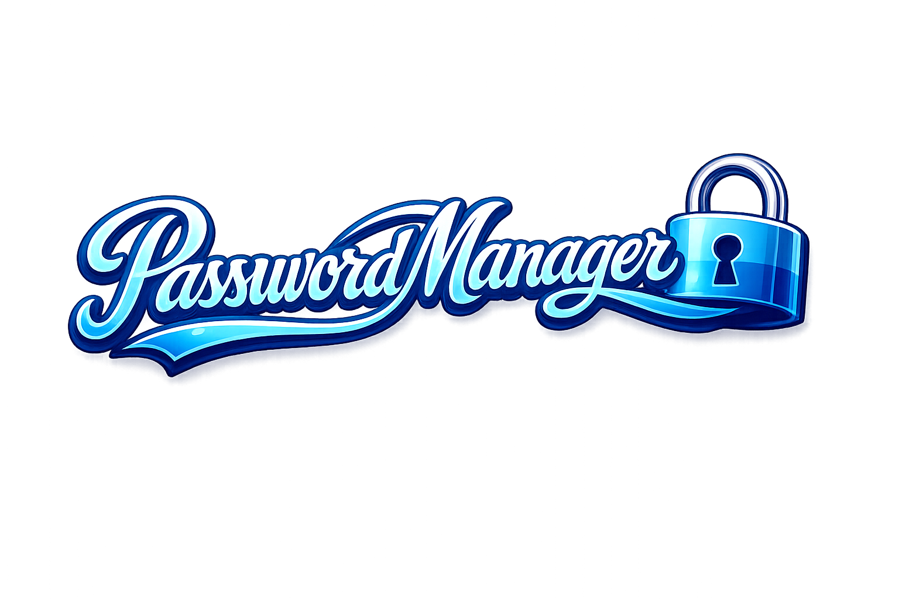
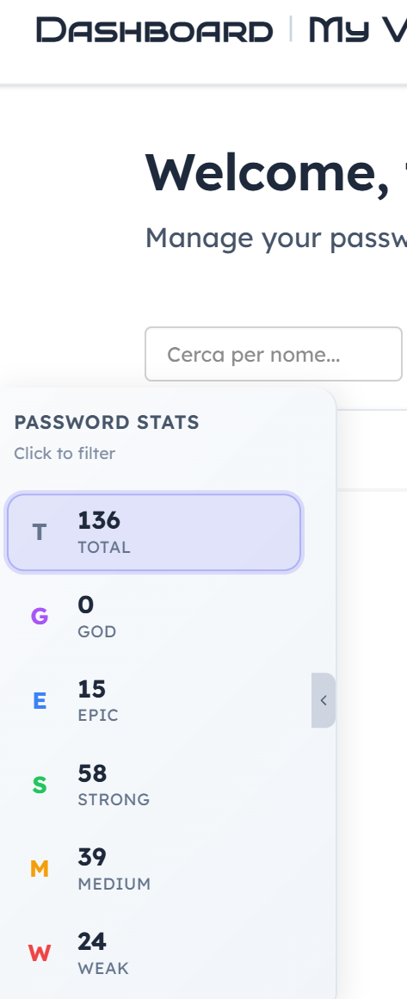

<p align="center">
  <b>If you find PWDManager useful, consider leaving a ⭐ on GitHub — it helps others discover it.</b>
</p>

<p align="center">
  
</p>

<h1 align="center">PWDManager</h1>

<p align="center">
  <strong>A fast, local-first password manager for Windows.</strong><br>
  No cloud. No subscriptions. No telemetry. Your passwords stay on your machine.
</p>

<p align="center">
  <a href="https://github.com/LucioPg/PWDManager/releases/latest">
    
  </a>
  &nbsp;
  <a href="https://github.com/LucioPg/PWDManager/releases/latest">
    
  </a>
</p>

<p align="center">
  Rust · Dioxus · <a href="https://github.com/LucioPg/PWDManager">Repository</a>
</p>

---

## Why PWDManager

Most password managers rely on cloud infrastructure or SaaS subscriptions. Even when they advertise end-to-end
encryption, their business model still depends on the user trusting a third-party server.

PWDManager takes a fundamentally different approach:

- The database is **encrypted at rest** with SQLCipher (AES-256, HMAC-SHA512). The file is indistinguishable from random
  data.
- Every credential field is **individually encrypted** with AES-256-GCM, using a key derived from the master password.
  No separate Data Encryption Key that could be extracted from memory or a keyring.
- The encryption key is stored in **Windows Credential Manager** (DPAPI, current-user scoped). It never leaves the
  machine.
- Your passwords are readable only with the master password, on this machine, by this user. Full stop.

### A UI that doesn't get in your way

PWDManager features a polished native interface with light and dark themes, built on DaisyUI 5 and Tailwind CSS.
No web-app feel, no Electron overhead -- just a fast, responsive desktop experience that starts in under a second.

Built on [Dioxus 0.7](https://dioxuslabs.com/) and Rust, PWDManager compiles to a single native binary. The UI runs on
the system WebView2 instance -- no bundled Chromium, no Electron overhead. The result is a compact, fast application
that starts in under a second and uses very little memory.

### Spot weak passwords at a glance

The dashboard filter panel shows password strength distribution at a glance. Click any level (WEAK, MEDIUM, STRONG,
EPIC, GOD) to instantly filter and fix weak entries -- especially useful after bulk imports from a browser.



### Dual password generation, fully configurable

Not all sites accept the same password format. PWDManager offers two generation modes, both fully configurable to
handle site-specific constraints like restricted symbols, length limits, or character requirements.

**Random passwords** can reach military-grade strength (GOD level, 96+ score) with fine-grained control over every
character class -- uppercase, lowercase, digits, and symbols can each be tuned independently.

**Diceware passphrases** produce mnemonic-friendly word sequences in English, Italian, or French, with optional numbers
and special characters. They are ideal for master passwords where memorability matters more than raw entropy.

## Security Architecture

PWDManager uses four independent encryption layers. Compromising one layer does not expose data protected by another.

```
Stored passwords
  |-- AES-256-GCM (per-field encryption, unique nonce per field)
  |
Database file
  |-- SQLCipher (AES-256, transparent page-level encryption)
  |
Database key
  |-- Windows Credential Manager (OS-provided DPAPI storage)
  |-- Recovery key path via Argon2id + dedicated salt
  |
User authentication
  |-- Argon2id (password hashing with zeroize)
```

### Layer 1 -- Database encryption (SQLCipher)

The entire SQLite database is encrypted at rest. Without the key, the file is indistinguishable from random bytes.

| Parameter      | Value                              |
|----------------|------------------------------------|
| Cipher         | AES-256                            |
| Page size      | 4096                               |
| HMAC           | SHA-512                            |
| KDF iterations | 256000                             |
| Mode           | WAL (concurrent read/write safety) |

### Layer 2 -- Per-field encryption (AES-256-GCM)

Each credential (username, URL, password, notes) is individually encrypted before storage. The AES-256-GCM cipher key is
derived from the user's master password via Argon2id. This means each user has their own encryption domain -- two users
with the same password store different ciphertext for the same credential.

Every field uses a cryptographically random 12-byte nonce, generated per-field at encryption time.

### Layer 3 -- Authentication (Argon2id)

User passwords are hashed with Argon2id before storage. The embedded salt within the hash is also extracted at runtime
to serve as the AES key derivation salt, avoiding a separate salt storage for the cipher. Memory is zeroized after
hashing via the `secrecy` crate.

### Layer 4 -- Key management

On first setup, a random 32-byte key is generated and stored in Windows Credential Manager. This key is used directly as
the SQLCipher encryption key.

If the keyring entry is lost or corrupted, a **recovery key** (6-word Diceware passphrase) serves as a backup path. The
key is derived via Argon2id with a dedicated 16-byte salt stored separately.

### In-memory protection

All passwords and sensitive data in memory use `SecretString` and `SecretBox<[u8]>` from the `secrecy` crate. These
types zeroize their contents automatically on drop. Access to the underlying value requires an explicit `ExposeSecret`
call -- accidental leaks through logging, printing, or copies are prevented at the type level.

### Anti-brute-force design

PWDManager does not implement account lockout. This is a deliberate design choice:

- **Argon2id IS the brute-force protection.** Each password attempt costs ~50ms of CPU-bound computation. Offline
  brute-force is already heavily mitigated by the KDF.
- **Four independent layers** mean that brute-forcing the master password alone does not produce readable data without
  the SQLCipher key in the keyring.
- **Lockout would be a self-DoS** on a local-only application. Typing the wrong password a few times would lock you out
  of your own vault with no recovery path -- a worse outcome than the already-minimized brute-force risk.
- **There is no server, no account, no rate limit target.** The protection lives entirely in the cryptographic cost.

See [docs/security.md](docs/security.md) for the full technical breakdown.

## Features

### Password management

- Store credentials with name, username, URL, password, and notes
- Password strength scoring on a 0-100 numeric scale, mapped to five levels: **WEAK, MEDIUM, STRONG, EPIC, GOD**
- Built-in blacklist for common password detection
- **Dashboard with vault composition statistics** -- a sidebar panel shows the count of passwords per strength level.
  Click a level to instantly filter the list. Essential after importing passwords from a browser to identify and fix
  weak entries at a glance.
- Paginated password list with configurable sorting (A-Z, Z-A, oldest, newest) and client-side search

### Password generation

- **Random password generator** with full configuration: length, uppercase, lowercase, digits, symbols count, and
  excluded symbols
- **Customizable presets** -- choose from Medium, Strong, Epic, God, or Custom. Each preset defines length and character
  constraints. Useful when sites restrict password length or prohibit certain symbols.
- **Diceware passphrase generator** in English, Italian, and French, with optional numbers and special characters

### Import / Export

- Export to **JSON, CSV, and XML**
- Import from all three formats with automatic deduplication by (URL, password) pair
- Skips passwords already present in the database during import
- Compatible with Chrome's and Firefox's CSV export -- export from `chrome://password-manager/settings` and import
  directly into PWDManager
- Bulk operations run in parallel via **Rayon** -- importing or exporting 10,000+ entries completes in under a second

### Desktop integration

- **Windows Hello auto-login** -- authenticate instantly via biometrics without typing your master password
- System tray icon with **visual state** (different icon when authenticated vs logged out)
- Tray menu actions: Open, Logout, Quit
- Closing the window hides the application without terminating the process
- Auto-start on Windows boot via HKCU registry key, with Task Manager disabled-state detection
- Activity tracking at OS level for auto-logout (Wry/Tao native event handler, not DOM events)

### Automatic updates

- Built-in updater with **minisign signature verification** -- the public key is embedded at compile-time, ensuring only
  authentic releases are installed
- **Breaking change protection** -- when an update requires data migration, a dialog prompts the user to export all
  vaults
  before proceeding
- One-click update from the notification UI

### Security features

- Configurable **auto-logout**: 10 minutes, 1 hour, or 5 hours of inactivity
- Recovery key generation and regeneration with full database rekey
- Password change with complete re-encryption pipeline and progress reporting

### Interface

- **Polished, responsive UI** built on DaisyUI 5 and Tailwind CSS -- native feel with zero web bloat
- Light and dark theme
- Custom NSIS installer

## Prerequisites

- [Rust](https://rustup.rs/) (edition 2024)
- [Node.js](https://nodejs.org/) (for Tailwind CSS build)
- Windows 10/11 (x86_64)
- Visual Studio Build Tools with the C++ workload

## Build

```bash
# Clone the repository with submodules
git clone --recurse-submodules https://github.com/LucioPg/PWDManager.git

# Development build with hot reload
dx serve --desktop

# Release build
dx build --desktop --release
```

The release build produces an NSIS installer in the `dist/` directory.

## Workspace structure

The project is a Cargo workspace with six crates:

| Crate           | Purpose                                                          |
|-----------------|------------------------------------------------------------------|
| `PWDManager`    | Main application (UI, routing, business logic)                   |
| `gui_launcher`  | Desktop launcher with window config, icon embedding, and logging |
| `custom_errors` | Typed errors (DBError, AuthError, CryptoError)                   |
| `pwd-types`     | Core types: PasswordScore, StoredPassword, UserAuth              |
| `pwd-strength`  | Password strength evaluation with blacklist support              |
| `pwd-crypto`    | Argon2 hashing and AES-256-GCM encryption                        |

`custom_errors`, `pwd-types`, `pwd-strength`, and `pwd-crypto` are external Git dependencies. `pwd-dioxus` provides
shared UI components.

## Application data

| Data          | Location                                       | Description          |
|---------------|------------------------------------------------|----------------------|
| Database      | `%LOCALAPPDATA%/PWDManager/pwdmanager.db`      | SQLCipher encrypted  |
| Salt          | `%LOCALAPPDATA%/PWDManager/pwdmanager.db.salt` | 16 bytes, Argon2id   |
| DB key        | Windows Credential Manager                     | Service `PWDManager` |
| Log           | `%LOCALAPPDATA%/PWDManager/pwdmanager.log`     | Application log      |
| WebView2 data | `%LOCALAPPDATA%/PWDManager/`                   | UI runtime data      |

## Technical documentation

- [docs/security.md](docs/security.md) -- security architecture, encryption layers, key management
- [docs/howto_sqlitetemplate.md](docs/howto_sqlitetemplate.md) -- sqlx-template guide for automatic CRUD generation
- [docs/nsis-custom-template.md](docs/nsis-custom-template.md) -- custom NSIS template for the installer

## License and Commercial Use

This project is licensed under the **Prosperity Public License 3.0.0**.

- **Personal and Non-Profit Use:** Free to use, study, and modify for personal, educational, or research purposes.
- **Commercial Use:** A 30-day trial period is granted. To continue using commercially, a dedicated license is required.

To request a quote or activate a license: **ldcproductions@proton.me** (subject: "Commercial License Request -
PWDManager")

---

*Built with [Dioxus](https://dioxuslabs.com/) (MIT/Apache 2.0). All third-party open-source components remain subject to
their respective licenses.*
